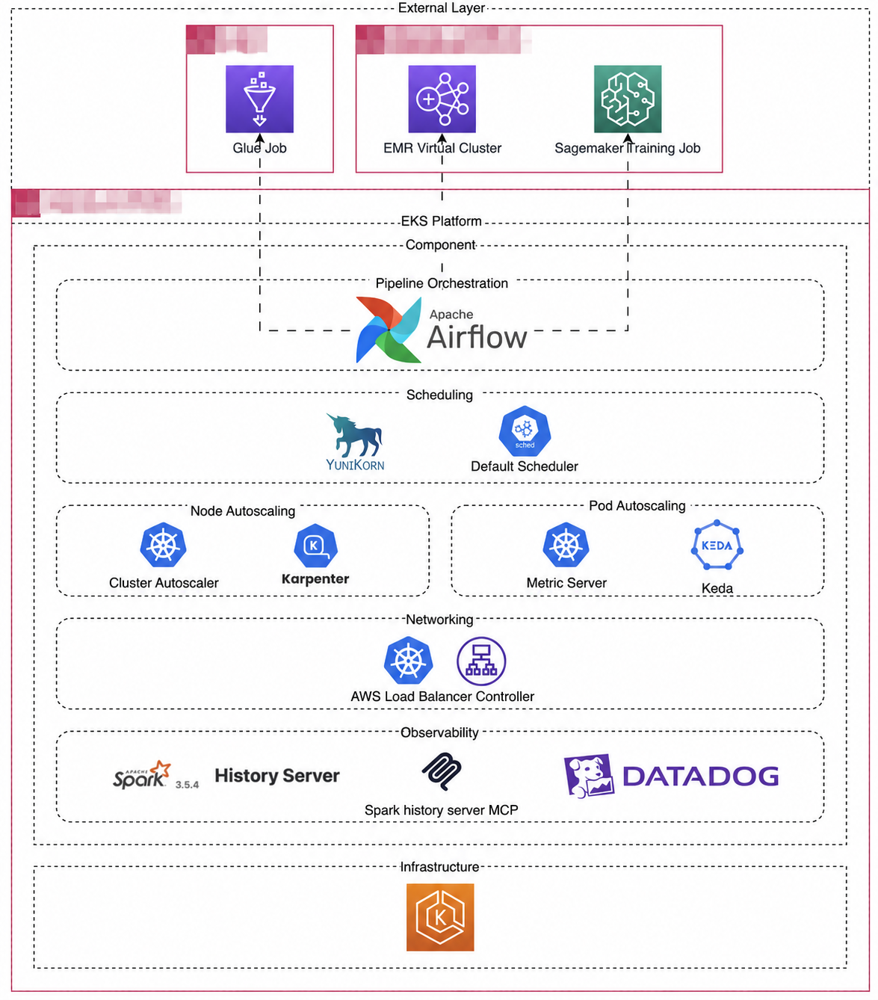
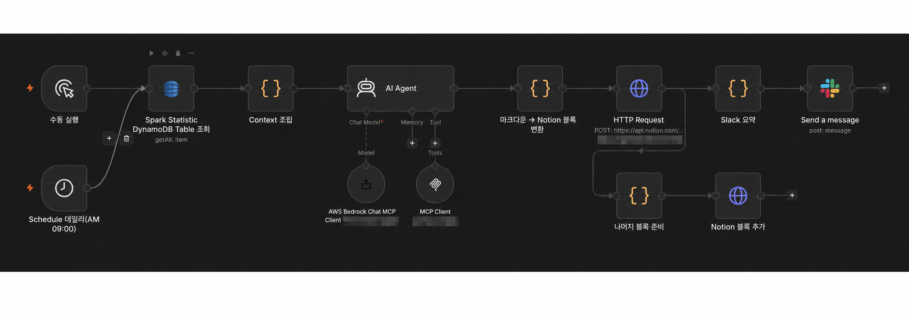
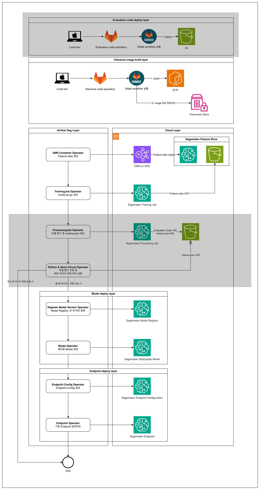

# 손창락

## DevOps Engineer | Data & AI Platform

AWS와 Kubernetes 환경에서 데이터·AI 워크로드가 실행되는 인프라와 배포, 오토스케일링과 모니터링 환경을 만들고 운영하고 있습니다.

시스템 운영으로 일을 시작해 Backend 개발을 경험했고, 현재는 EKS 기반 데이터 플랫폼 인프라를 담당하고 있습니다. Pod Scheduling과 Node 공급, IaC, CI/CD와 장애 확인을 한 흐름으로 보고 있습니다.

- Email: [thsckdfkr@gmail.com](mailto:thsckdfkr@gmail.com)
- Resume: [resume/Resume.md](./resume/Resume.md)

## 먼저 보여드리고 싶은 경험

### EKS에서 데이터 워크로드 운영

Spark Driver와 Executor를 Kubernetes Pod로 실행하고, Airflow가 작업을 제출한 뒤 YuniKorn과 Karpenter가 Pod 배치와 Node 공급을 담당하도록 구성했습니다.

전환 후 기존 환경과 비교해 플랫폼 비용을 약 30% 줄였고, Spark 처리 시간은 작업에 따라 약 20~30% 개선했습니다.

### Terraform·Helm·GitLab 기반 배포

AWS Resource는 Terraform으로, Kubernetes Application과 설정은 Helm으로 관리했습니다. GitLab Runner에서 Container Image를 Build해 ECR에 저장하고 Lambda와 환경별 EKS Application에 배포했습니다.

### 실행 상태를 계층별로 확인

Spark History Server, Datadog, Grafana와 CloudWatch를 이용해 Application, Kubernetes와 AWS Resource 상태를 확인했습니다. 전날 Spark 실행 이력은 EventBridge와 Lambda로 수집해 Notion과 Slack 리포트로 전달했습니다.

### ML 워크로드 배포와 운영

Airflow에서 Spark Feature 생성, SageMaker Training과 Processing 기반 평가, Model Registry 등록과 Endpoint 변경을 실행하도록 구성했습니다. 평가 코드는 S3에, Inference Image는 ECR에 배포해 실행 단계와 Artifact 전달을 나눴습니다.

## Portfolio

1. [EKS 기반 데이터 워크로드 플랫폼](./portfolio/01_EKS_Workload_Platform.md)
2. [Terraform·Helm·GitLab 기반 배포 환경](./portfolio/02_IaC_and_Delivery.md)
3. [Observability와 운영 자동화](./portfolio/03_Observability_and_Operations.md)
4. [MLOps 실행·배포 흐름](./portfolio/04_MLOps_Operations.md)
5. [Cloud·On-Premise 환경과 자산 관리](./portfolio/05_Hybrid_Cloud_and_Assets.md)

## 기술

| 구분 | 기술 |
|---|---|
| Cloud | AWS, EKS, EC2, S3, EMR, Lambda, EventBridge, DynamoDB, ECR, CloudWatch |
| Kubernetes | Kubernetes, Docker, Helm, Karpenter, YuniKorn, KEDA, Cluster Autoscaler, AWS Load Balancer Controller |
| IaC / Delivery | Terraform, CloudFormation, GitLab CI/CD, GitLab Runner, Shell Script, ECR, Container Image |
| Observability | Datadog, Grafana, CloudWatch, Spark History Server, Splunk |
| Data / AI Workload | Spark, Airflow, Databricks, SageMaker, Glue, Athena, Amazon Bedrock, n8n |
| Development | Python, Java, Spring Boot, Node.js, PostgreSQL, MySQL, Elasticsearch, OpenSearch |

## 운영할 때 보는 순서

배포가 성공했다는 상태만 보지 않습니다. 문제가 생기면 요청이 들어오는 지점부터 Application, Pod, Scheduler, Node와 외부 AWS Service를 나눠 확인합니다. Spark 작업은 Job 제출 전후를 구분하고, ML Pipeline은 Feature·학습·평가·배포 단계를 분리해 실패 위치를 찾습니다.

시스템 운영과 Backend 개발 경험 덕분에 인프라만 따로 보지 않고, Application Log와 외부 서비스 연결까지 함께 확인하는 편입니다.

