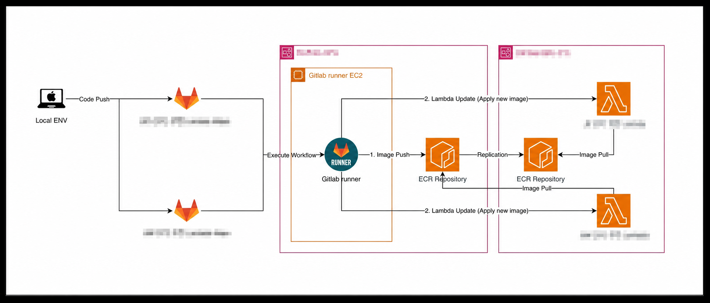
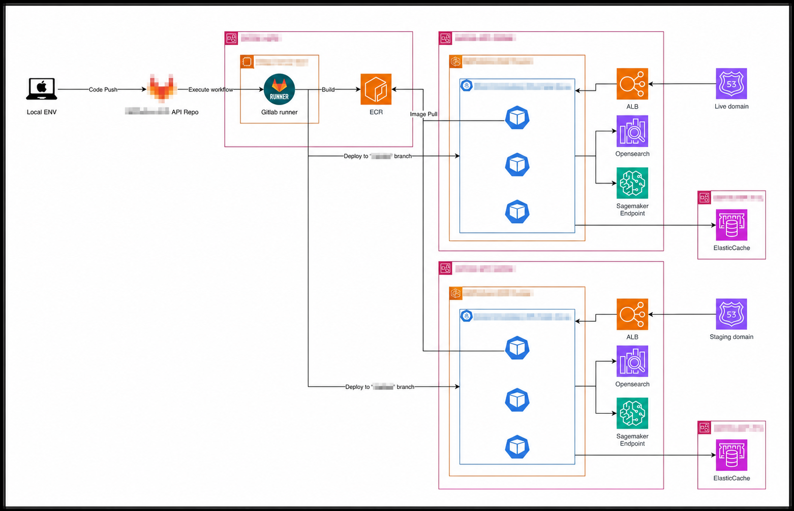

# Terraform·Helm·GitLab 기반 배포 환경

> AWS Resource와 Kubernetes Application의 관리 범위를 나누고, GitLab Runner와 ECR을 이용해 Lambda와 EKS Application을 배포했습니다.

## 관리 범위

| 변경 대상 | 관리 위치 |
|---|---|
| AWS Resource | Terraform / CloudFormation |
| Kubernetes Resource | Helm |
| Container Image | GitLab Runner / ECR |
| 환경별 배포 | GitLab Workflow |
| Runtime 연결 | ALB, OpenSearch, SageMaker Endpoint, ElastiCache 설정 |

AWS Resource와 Kubernetes 설정을 같은 위치에서 관리하지 않았습니다. Infrastructure 변경은 Terraform에서, Application과 Kubernetes 설정은 Helm에서 확인할 수 있도록 범위를 나눴습니다.

## GitLab Runner 환경

기존 CI/CD가 적용되지 않은 서비스도 같은 방식으로 배포할 수 있도록 GitLab Runner 환경과 배포 절차를 구성했습니다.

- GitLab Runner 환경 구축
- Build와 배포 순서를 Shell Script로 정리
- 서비스 Repository와 GitLab Workflow 연결
- 내부 ECR을 기준으로 Container Image와 Helm Chart 관리

## Lambda Container Image 배포

    Code Push
      → GitLab Workflow
      → GitLab Runner에서 Image Build
      → ECR Push
      → 대상 환경 ECR로 Image 전달
      → Lambda Function Image 변경

## EKS Application 배포

    Repository
      → GitLab Runner
      → ECR
      → 환경별 EKS Cluster
      → ALB
      → Application
           ├─ OpenSearch
           ├─ SageMaker Endpoint
           └─ ElastiCache

## 맡았던 일

- 서비스 Repository와 GitLab Workflow 연결
- GitLab Runner 기반 Container Image Build
- ECR Push와 환경 간 Image 전달
- Lambda Function Image 변경 흐름 구성
- 환경별 EKS Application 배포 구성
- ALB, OpenSearch, SageMaker Endpoint와 ElastiCache 연결 구조 운영

## 배포 확인 순서

1. GitLab Workflow와 Runner 실행 상태를 확인했습니다.
2. Image Tag와 ECR Push 결과를 확인했습니다.
3. 대상 환경에서 Image를 Pull할 수 있는지 확인했습니다.
4. Lambda Image 변경 또는 EKS Rollout 상태를 확인했습니다.
5. ALB Health Check와 Application Log를 확인했습니다.
6. OpenSearch, SageMaker Endpoint와 ElastiCache 연결 상태를 확인했습니다.

## 정리

배포 명령을 줄이는 데만 초점을 두지 않았습니다. 어떤 Repository와 Image Tag가 어느 환경에 배포됐는지 같은 기준으로 확인할 수 있게 만드는 것이 중요했습니다.

