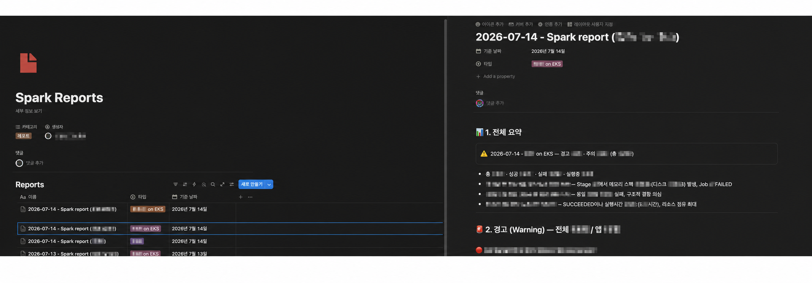

# Observability와 운영 자동화

> Application, Kubernetes와 Spark 실행 상태를 나눠 확인하고, 반복적으로 보던 Spark 실행 이력은 별도 리포트로 정리했습니다.

## 확인한 계층

| 계층 | 확인 도구와 항목 |
|---|---|
| Workflow | Airflow Task 상태와 Log |
| Kubernetes | Pod Event, Resource Request, Scheduler, Node 상태 |
| Spark | Application, Job, Stage, Shuffle, Spill, Data Skew |
| AWS | CloudWatch, EMR Job Run, ECR, Lambda와 연결 Service 상태 |
| Platform | Datadog, Grafana, Spark History Server |

운영할 때 하나의 Dashboard만 보지 않았습니다. 작업이 제출되기 전과 후를 나누고, Application이 시작되지 않았으면 Kubernetes 계층을, 실행이 시작된 뒤 느리거나 실패했으면 Spark Job과 Stage를 확인했습니다.

## Spark 실행 이력 수집

Spark Application 수가 늘면서 전날 실행 결과를 하나씩 확인하는 데 시간이 걸렸습니다. 성공·실패뿐 아니라 실행 시간이 길거나 Resource 사용량이 큰 작업도 먼저 확인할 필요가 있었습니다.

    EventBridge
      → Lambda
      → Spark History Server 조회
      → DynamoDB 저장
      → n8n / Amazon Bedrock 분석
      → Notion Report
      → Slack Summary

## Workflow

- EventBridge, Lambda와 DynamoDB 기반 Application 수집 흐름을 구성했습니다.
- n8n에 정기·수동 Trigger를 두고 전날 통계를 조회하도록 했습니다.
- 필요한 경우 Spark History Server MCP에서 Job과 Stage 세부 정보를 조회하도록 연결했습니다.
- Notion에는 전체 리포트를 남기고 Slack에는 요약만 전달했습니다.

## Report

분석 결과만으로 설정을 바꾸거나 작업을 중지하지 않았습니다. 먼저 확인할 작업과 이유를 정리하고 실제 조치는 운영자가 수행하도록 구성했습니다.

## 이 경험이 DevOps 업무와 연결되는 부분

모니터링 도구를 설치한 것보다, 문제가 발생한 계층을 나눠 확인하고 반복되는 확인 작업을 자동화한 경험에 의미가 있습니다. 시스템 운영과 Backend 개발 경험도 Application Log와 Infrastructure 상태를 함께 보는 데 도움이 됐습니다.

